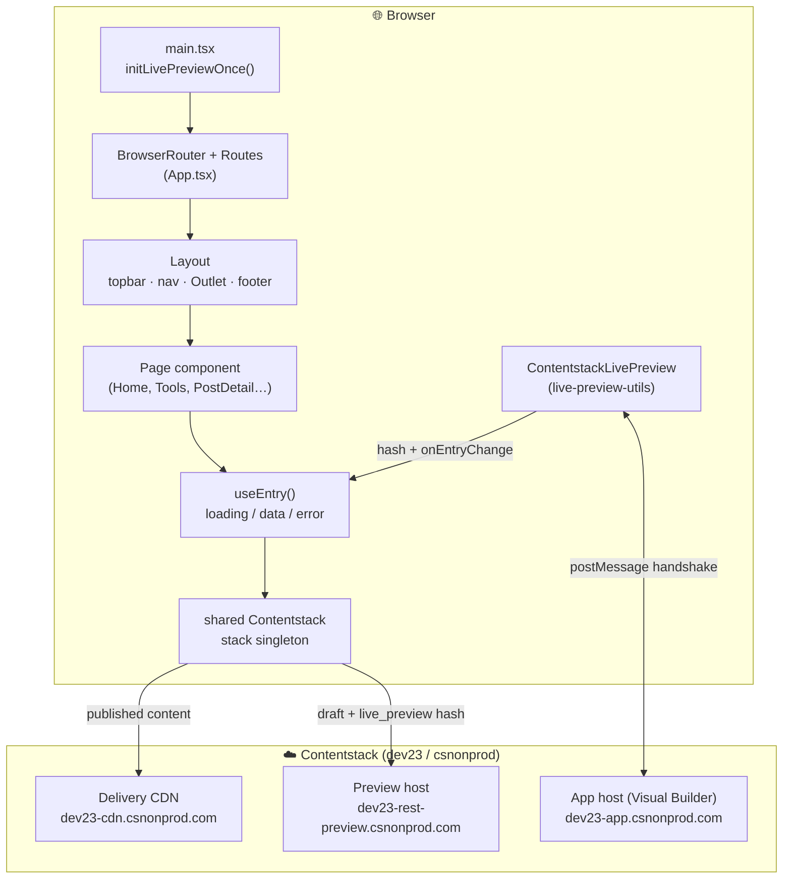
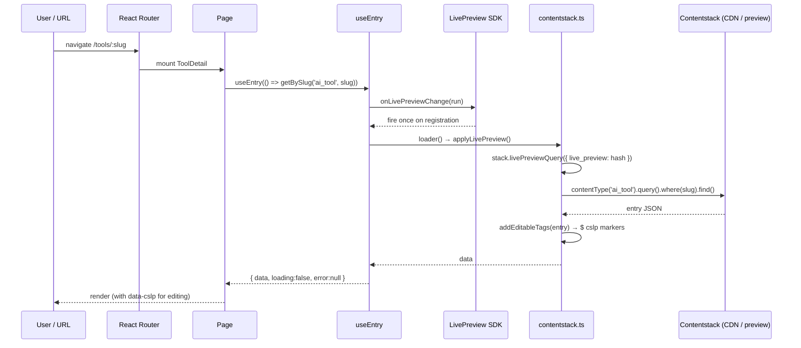
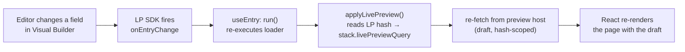
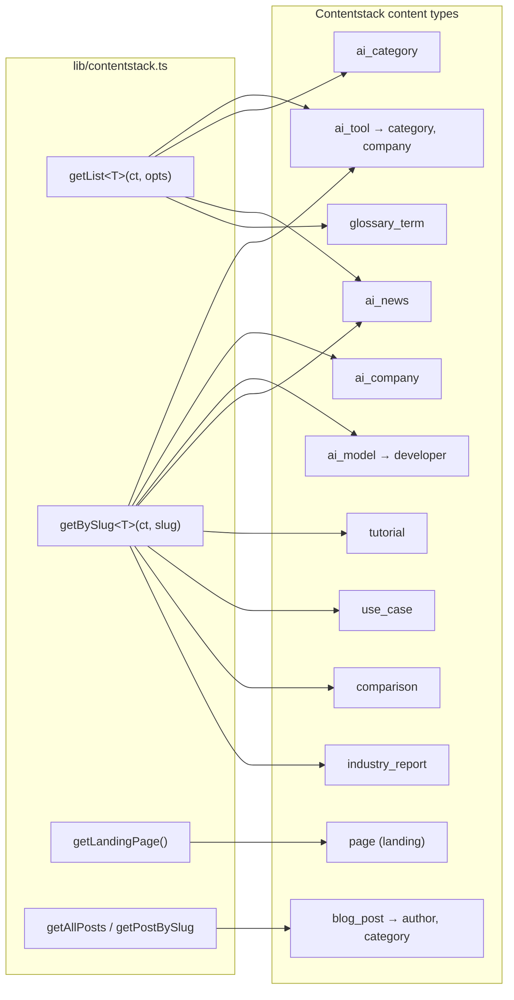
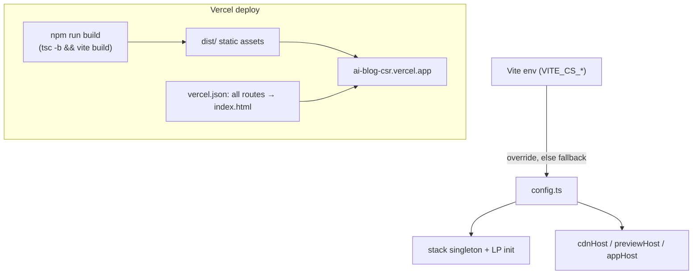

# Synapse CSR — Visual Explainer

A visual walkthrough of **`ai-blog-csr`**, the client-side-rendered "Synapse — AI technology journal" demo app. It is a Vite + React 19 + React Router 7 single-page app that reads content from a Contentstack stack via the Delivery SDK and re-renders live inside the Contentstack Visual Builder.

> Diagrams below use [Mermaid](https://mermaid.js.org/) and render automatically on GitHub.

---

## 1. At a glance

| | |
|---|---|
| **Type** | Client-side-rendered SPA (no server; static assets) |
| **Stack** | Vite 6 · React 19 · React Router 7 (`BrowserRouter`) · TypeScript |
| **Content** | Contentstack Delivery SDK (`@contentstack/delivery-sdk` v5) |
| **Live editing** | Contentstack Live Preview (`@contentstack/live-preview-utils` v4, `mode: 'builder'`) |
| **Edit tags** | `@contentstack/utils` `addEditableTags` (data-cslp attributes) |
| **Source stack** | dev23 / csnonprod, `development` environment, `en-us` |
| **Deploy** | Vercel — https://ai-blog-csr.vercel.app (SPA rewrite: all routes → `index.html`) |
| **Dev server** | `npm run dev` → port **3010** |

---

## 2. Architecture

How the browser, the SPA, the Contentstack CDN/preview hosts, and the Visual Builder iframe relate.

**Two read paths from the same `stack` singleton:** published reads hit the **CDN**; when running inside the Visual Builder the SDK attaches a `live_preview` hash and reads **drafts** from the **preview host** instead.

---

## 3. Data flow: route → render

The lifecycle of a single page view, from URL to painted content. Note that the **first** fetch is driven by Live Preview's `onEntryChange` callback (which fires once on registration), not a bare `useEffect` fetch — this guarantees the in-iframe initial load carries the preview hash.

---

## 4. Live Preview reactivity

What happens when content changes. The key distinction: this is an **editor preview channel**, not multi-user real-time sync. Updates flow only into the editing session's own preview pane.

- **Inside the Visual Builder iframe** → live updates as the editor types (above).
- **A normal visitor on the published site** → `onEntryChange` fires only once on load; there is **no socket / polling**, so a publish is seen on the next reload.

> ⚠️ **`livePreviewQuery` is a `stack` method, not a query method.** `applyLivePreview()` calls `stack.livePreviewQuery(...)` *before* building each query. Calling `.livePreviewQuery()` on a query/entry object throws `livePreviewQuery is not a function`.

---

## 5. Pages & routes

`App.tsx` mounts every route under a single `Layout` (shared topbar/nav/footer). List routes show grids; `:slug` routes show detail pages.

```mermaid
flowchart TB
  Layout["Layout (topbar · nav · footer)"]
  Layout --> Home["/ → Home"]
  Layout --> Blog["/blog · /blog/:slug"]
  Layout --> Topics["/topics"]
  Layout --> Tools["/tools · /tools/:slug"]
  Layout --> Companies["/companies · /companies/:slug"]
  Layout --> Models["/models · /models/:slug"]
  Layout --> News["/news · /news/:slug"]
  Layout --> Tutorials["/tutorials · /tutorials/:slug"]
  Layout --> Glossary["/glossary"]
  Layout --> UseCases["/use-cases · /use-cases/:slug"]
  Layout --> Compare["/compare · /compare/:slug"]
  Layout --> Reports["/reports · /reports/:slug"]
  Layout --> Debug["/all-fields · /graphql (debug)"]
  Layout --> NotFound["* → Empty (not found)"]
```

**Nav order** (`Layout.tsx`): Home · Tools · Models · Companies · News · Tutorials · Glossary · Compare · Use Cases · Reports · Blog · All Fields · GraphQL.

---

## 6. Content model

The content types the app reads, and the generic helpers in `lib/contentstack.ts` that read them.

Every fetched entry is decorated with `addEditableTags(entry, ct, true, locale)` so the rendered DOM carries `data-cslp` markers the Visual Builder uses to map elements back to fields.

---

## 7. Configuration & deploy

- Tokens are **baked in as fallbacks** in `config.ts`, so the app works on Vercel with no env vars set. Override per-environment with `VITE_CS_*`.
- The delivery token is scoped to **`development`** only; pointing `environment` at `preview` returns error 141 / HTTP 422.
- The SPA **needs** the `vercel.json` rewrite (`/* → /index.html`) or deep links 404.

---

## 8. Key files

| File | Responsibility |
|---|---|
| `src/main.tsx` | Boot: `initLivePreviewOnce()` then mount `BrowserRouter` |
| `src/App.tsx` | Route table (all under `Layout`) |
| `src/components/Layout.tsx` | Topbar, nav, `<Outlet>`, footer |
| `src/lib/config.ts` | Env-or-fallback Contentstack config |
| `src/lib/contentstack.ts` | `stack` singleton, LP init, `applyLivePreview`, fetch helpers |
| `src/lib/useEntry.ts` | Hook: load via `onEntryChange`, expose `{data, loading, error}` |
| `src/lib/hub-types.ts` / `types.ts` | TypeScript shapes for the content types |
| `src/pages/*` | One component per route (list + detail) |
| `src/components/States.tsx` | Loading / empty / error UI |

---

*Generated as a visual explainer for the `ai-blog-csr` app. Diagrams reflect the code at the time of writing — `App.tsx`, `Layout.tsx`, `config.ts`, and `contentstack.ts` are the sources of truth if anything drifts.*
